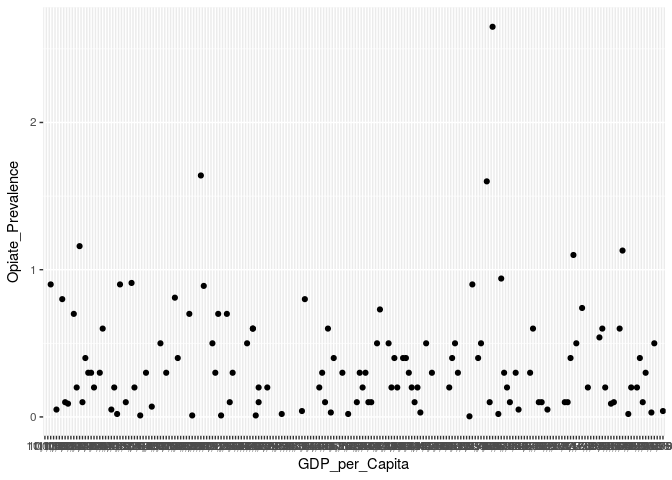
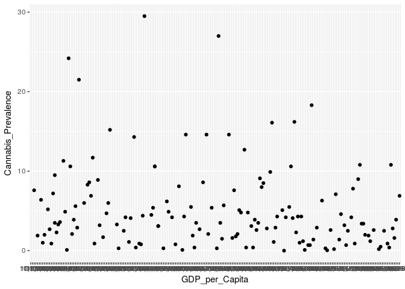
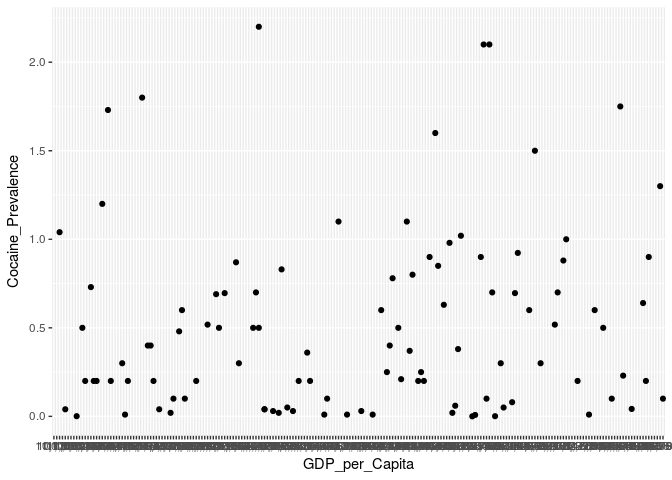

    opiateuse <- read_html("https://en.wikipedia.org/wiki/List_of_countries_by_prevalence_of_opiates_use")
    opiateuse2 <- html_nodes(opiateuse, css = "table")
    opiateusetable <- as.tibble(html_table(opiateuse2, header = TRUE, fill = TRUE)[[1]])

    cannabisuse <- read_html("https://en.wikipedia.org/wiki/Annual_cannabis_use_by_country")
    cannabisuse2 <- html_nodes(cannabisuse, css = "table")
    cannabisusetable <- as.tibble(html_table(cannabisuse2, header = TRUE, fill = TRUE)[[1]])

    cocaineuse <- read_html("https://en.wikipedia.org/wiki/List_of_countries_by_prevalence_of_cocaine_use")
    cocaineuse2 <- html_nodes(cocaineuse, css = "table")
    cocaineusetable <- as.tibble(html_table(cocaineuse2, header = TRUE, fill = TRUE)[[1]])

    governmentsystem <- read_html("https://en.wikipedia.org/wiki/List_of_countries_by_system_of_government")
    governmentsystem2 <- html_nodes(governmentsystem, css = "table")
    governmentsystemtable <- as.tibble(html_table(governmentsystem2, header = TRUE, fill = TRUE)[[6]])

    governmentbudget <- read_html("https://en.wikipedia.org/wiki/List_of_countries_by_government_budget")
    governmentbudget2 <- html_nodes(governmentbudget, css = "table")
    governmentbudgettable <- as.tibble(html_table(governmentbudget2, header = TRUE, fill = TRUE)[[1]])

    gdppercapita <- read_html("https://en.wikipedia.org/wiki/List_of_countries_by_GDP_(nominal)_per_capita")
    gdppercapita2 <- html_nodes(gdppercapita, css = "table")
    gdppercapitatable <- as.tibble(html_table(gdppercapita2, header = TRUE, fill = TRUE)[[5]])

    mastertable <- gdppercapitatable%>%
      left_join(governmentbudgettable, by = "Country")%>%
      select("Country", "US$", "Revenues", "Expenditures", "Surplus (or deficit)", "Year")%>%
      left_join(governmentsystemtable, by = c("Country" = "Name"))%>%
      left_join(opiateusetable, by = c("Country" = "Country or Entity"))%>%
      left_join(cannabisusetable, by = c("Country" = "Country or entity"))%>%
      left_join(cocaineusetable, by = c("Country" = "Country or entity"))%>%
      select("Country", "Year.x", "US$", "Revenues", "Expenditures", "Surplus (or deficit)", "Constitutional form", "Head of state", "Annual prevalence (percent).x", "Annual prevalence\n(percent)","Annual prevalence (percent).y")%>%
      rename("Head_of_State" = "Head of state", "Constitution_Form" = "Constitutional form", "Revenues" = "Revenues", "GDP_per_Capita" = "US$", "Expenditures" = "Expenditures", "Surplus_or_Deficit" = "Surplus (or deficit)","Year" = "Year.x", "Opiate_Prevalence" = "Annual prevalence (percent).x", "Cannabis_Prevalence" = "Annual prevalence\n(percent)", "Cocaine_Prevalence" = "Annual prevalence (percent).y")
    mastertable

    ## # A tibble: 219 x 11
    ##    Country   Year    GDP_per_Capita Revenues Expenditures Surplus_or_Defi…
    ##    <chr>     <chr>   <chr>          <chr>    <chr>        <chr>           
    ##  1 Monaco    2011 e… 168,004        915      973          -59             
    ##  2 Liechten… 2012 e… 164,437        995      890          105             
    ##  3 Luxembou… 2016 e… 101,835        25,850   25,520       330             
    ##  4 Bermuda   2016 e… 99,363         960      1,154        -194            
    ##  5 Switzerl… 2016 e… 79,609         215,900  213,400      2,500           
    ##  6 Macau     2016 e… 73,187         12,120   7,004        5,116           
    ##  7 Norway    2016 e… 70,617         199,800  188,800      11,000          
    ##  8 Ireland   2016 e… 64,497         78,470   80,860       -2,390          
    ##  9 Cayman I… 2016 e… 63,261         860      742          118             
    ## 10 Iceland   2016 e… 60,966         10,350   7,911        2,439           
    ## # ... with 209 more rows, and 5 more variables: Constitution_Form <chr>,
    ## #   Head_of_State <chr>, Opiate_Prevalence <dbl>,
    ## #   Cannabis_Prevalence <dbl>, Cocaine_Prevalence <dbl>

    #mastertable%>%
    #  group_by(Constitution_Form)%>%
    #  summarize(average_GDPpC = mean(GDP_per_Capita, na.rm=TRUE))

    mastertable%>%
      ggplot(mapping = aes(x = GDP_per_Capita))+
      geom_point(mapping = aes(y = Opiate_Prevalence))

    ## Warning: Removed 94 rows containing missing values (geom_point).

    mastertable%>%
      ggplot(mapping = aes(x = GDP_per_Capita))+
      geom_point(mapping = aes(y = Cannabis_Prevalence))

    ## Warning: Removed 68 rows containing missing values (geom_point).

    mastertable%>%
      ggplot(mapping = aes(x = GDP_per_Capita))+
      geom_point(mapping = aes(y = Cocaine_Prevalence))

    ## Warning: Removed 114 rows containing missing values (geom_point).

